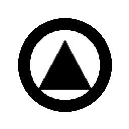
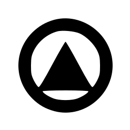
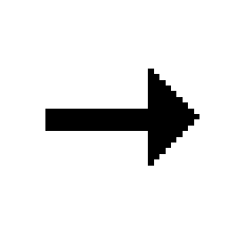
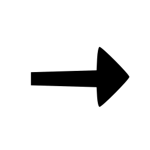
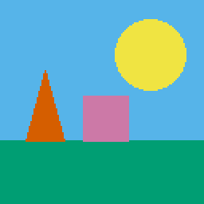
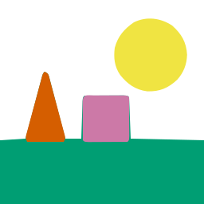

# svgsmith

> Agent-native, self-verifying raster→SVG vectorizer.

[](https://pypi.org/project/svgsmith/)
[](https://pypi.org/project/svgsmith/)
[](LICENSE)
[](https://github.com/realproject7/svgsmith/actions/workflows/ci.yml)

```bash
pip install svgsmith
```

`svgsmith` turns PNG/JPG images into **editable** SVG. It is built to be driven by an
AI agent without a human in the loop: it picks the right tracing engine for the input,
post-processes the result into clean editable layers, and **verifies its own output** by
re-rasterizing the SVG and comparing it to the original — re-tuning until a quality
threshold is met. Every run returns a structured JSON report so a calling agent can
decide whether to accept, retry, or escalate.

It does **not** reinvent tracing. It wraps proven engines
([VTracer](https://github.com/visioncortex/vtracer) for color,
[Potrace](https://potrace.sourceforge.net/) for line art) and adds the layer that is
missing for agent use: routing, editable output, and a self-verification loop.

> **Status:** released — `svgsmith 0.1.0` is on [PyPI](https://pypi.org/project/svgsmith/).
> Engine routing, editable post-processing, the self-verify loop, the CLI + JSON report,
> SVG→PNG rasterization, and the [`vectorize` skill](skills/vectorize/SKILL.md) are all in.

## System dependencies

The line-art engine shells out to the [**Potrace**](https://potrace.sourceforge.net/)
binary (svgsmith does not bundle a Potrace Python binding). Install it from your
package manager before use:

The self-verify loop rasterizes SVGs with [CairoSVG](https://cairosvg.org/), which needs
the **Cairo** system library. Install both:

```bash
# Debian / Ubuntu
sudo apt-get install -y potrace libcairo2 libcairo2-dev
# macOS (Homebrew)
brew install potrace cairo
```

The color engine ([VTracer](https://github.com/visioncortex/vtracer)) ships as a
pinned PyPI wheel and needs no system package.

## Installation

Requires **Python 3.11+**. Install the [system dependencies](#system-dependencies)
above first, then svgsmith:

```bash
pip install svgsmith
```

### From source

```bash
git clone https://github.com/realproject7/svgsmith
cd svgsmith
pip install .          # add ".[dev]" for the test/lint extras
```

Verify the install:

```bash
svgsmith --version
svgsmith convert path/to/image.png --out out.svg --report json
```

## What makes it different

- **Auto-routing** — classifies the input (logo/icon vs illustration vs pixel art) and
  selects the engine + preset automatically. No tracer-flag expertise required.
- **Editable output** — instead of one monolithic `<path>`, output is grouped into
  `<g>` layers with simplified paths and a consolidated color palette.
- **Self-verifying** — converts, re-rasterizes, diffs against the original (SSIM), and
  re-tunes parameters until it converges on a quality target.
- **Structured report** — emits JSON (mode, engine, iterations, similarity score,
  warnings) so agents can branch programmatically.
- **Local & private** — runs fully offline; images never leave the machine.

## Gallery

Each pair is the original raster (left) and the svgsmith SVG output (right), rendered at the
same size. Fixtures are self-generated (see `tests/corpus/`).

| | Original | svgsmith SVG |
|---|---|---|
| **Logo** (`--mode binary`) |  |  |
| **Icon** (`--mode binary`) |  |  |
| **Illustration** (`--mode color`) |  |  |
| **Pixel art** (`--mode pixel`) |  |  |

## Usage

```bash
svgsmith convert input.png \
  --mode auto \         # auto | binary | color | pixel
  --quality 0.9 \       # target similarity (0–1), drives the verify loop
  --max-iters 4 \
  --editable \          # editable layered output (default on; --no-editable for raw)
  --out output.svg \
  --report json
```

### Flags

| Flag | Default | Meaning |
|---|---|---|
| `--mode {auto,binary,color,pixel}` | `auto` | `auto` classifies the image and routes it: `binary`→Potrace (logos/line art), `color`→VTracer (illustrations), `pixel`→VTracer pixel preset. |
| `--quality FLOAT` | `0.9` | Target fidelity in `[0,1]` (SSIM vs the original). Drives the verify loop. |
| `--max-iters INT` | `4` | Max verify/refine iterations before returning the best result so far. |
| `--editable` / `--no-editable` | on | Editable grouped/simplified SVG, or the raw traced output. |
| `--smooth` / `--no-smooth` | on | Curve-refit color contours into smooth, sparse Béziers (Schneider least-squares). |
| `--detail {high,normal,clean,poster}` | `normal` | Color detail dial. `high` = maximum detail; `clean` = edge-preserving cleanup (less noise/grain); `poster` = bold flat graphic with few colors. |
| `--solid-background` | off | Isolate the subject and repaint the background as one clean solid color — removes texture/grain/specks while keeping subject detail. |
| `--uniform-outline` | off | Force an even-width outline band (outlined illustrations only; would add a wrong border on line art). |
| `--out PATH` | `<input>.svg` | Output SVG path. |
| `--report {off,json}` | `off` | Print a JSON report to stdout (the only thing on stdout). |

> **Composable for agents.** svgsmith is meant to be driven by an AI agent that maps a
> user's intent to flags. *"Detailed character on a clean flat background"* →
> `--detail high --solid-background`; *"poster-style, minimal"* → `--detail poster`;
> *"crisp logo"* → `--mode binary`; *"keep the raw look"* → `--no-smooth`. The
> [`vectorize` skill](skills/vectorize/SKILL.md) encodes this mapping.

### Rasterize (SVG → PNG)

The inverse command renders an SVG back to a PNG (preview, thumbnail, round-trip):

```bash
svgsmith rasterize input.svg --out out.png        # intrinsic (viewBox) size
svgsmith rasterize input.svg --width 512           # fixed width
svgsmith rasterize input.svg --scale 2 --background white
```

### Output

The SVG is **responsive and scalable**: it carries a `viewBox` and no fixed pixel
dimensions (`style="width:100%;height:100%"`, `preserveAspectRatio="xMidYMid meet"`),
so it fits any container or browser window with its aspect ratio preserved — no
overflow or scrollbars.

### Exit codes

| Code | Meaning |
|---|---|
| `0` | Success — `similarity >= --quality`. |
| `2` | SVG was produced but stayed below the quality target (still written to `--out`). |
| `1` | Hard error (e.g. unreadable input, missing `potrace` binary). |

### JSON report

```json
{
  "output": "output.svg",
  "mode_used": "color",
  "engine": "vtracer",
  "preset": "illustration",
  "iterations": 2,
  "similarity": 0.93,
  "passed_threshold": true,
  "svg": { "paths": 84, "groups": 6, "colors": 12, "bytes": 14820 },
  "warnings": []
}
```

| Field | Meaning |
|---|---|
| `mode_used` / `engine` / `preset` | What the router actually chose. |
| `iterations` | How many verify/refine passes ran. |
| `similarity` | Best SSIM achieved vs the original. |
| `passed_threshold` | `similarity >= --quality`. |
| `svg` | Output stats: path count, `<g>` groups, distinct colors, byte size. |
| `warnings` | Human-readable caveats (e.g. photographic gradients that vectorize poorly). |

## How the self-verify loop works

svgsmith doesn't trust a single trace. After producing an SVG it:

1. **re-rasterizes** the SVG back to a bitmap (via `cairosvg`) at the original resolution,
2. **scores** it against the source with SSIM — that score is `similarity`,
3. if it's below `--quality`, **re-tunes** the trace/post-process parameters and retries,
   up to `--max-iters`, and
4. returns the **best-scoring** result with the score in the report.

That closed loop is what lets an agent run svgsmith unsupervised: it gets a converged
result and a confidence number, not a guess. For an end-to-end agent wrapper, see the
[`vectorize` skill](skills/vectorize/SKILL.md).

## License

MIT — see [LICENSE](LICENSE).
